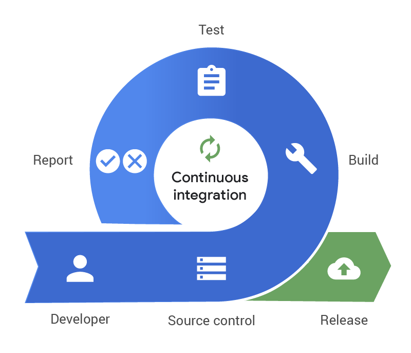

# Continuous Integration

### Software Delivery Lifecyle

In the lifecycle of creating software, there are several stages:

- **Plan**: This is where you figure out what you want the software to do and how you're going to do it. You outline the features, functionalities, and timelines.

- **Design**: Here, you create a blueprint for how the software will work. You decide on the architecture, user interface, and other technical aspects.

- **Develop**: This is where the actual coding happens. Developers write the code based on the plan and design.

- **Deploy**: Once the software is ready, it needs to be released to users. Deployment involves making the software available for use, whether it's installing it on servers or distributing it to users' devices.

### Continuous Integration (CI)

Continuous Integration (CI) is when developers regularly merge their code changes into a shared repository. Each merge triggers an automated build and test process, allowing teams to detect problems early and often.

### Building CI

Building CI involves setting up tools and processes to automate the integration, build, and testing of code changes. This typically includes using:
- Version control systems (e.g. Git)
- Automated build tools (e.g. AWS CodePipeline)
- Testing frameworks.

### Research & Development

- **What**: CI ensures frequent integration of code changes into a shared repository, which helps in early detection of issues.

- **Where**: CI is implemented within the development workflow of software projects, typically in version control systems like Git and collaboration platforms like GitHub or GitLab.

- **Why**: Continuous Integration helps teams to catch bugs early in the development process, reduces integration problems, allows for faster delivery of features, and promotes collaboration among developers.

- **How**: Continuous Integration is achieved through automation tools that monitor changes in the code repository, trigger build processes, run automated tests, and provide feedback to developers.

- **When**: Continuous Integration should be implemented from the beginning of a project and integrated into the development process as a standard practice. It should occur continuously throughout the development lifecycle, ideally with each code change triggering an automated build and test process.