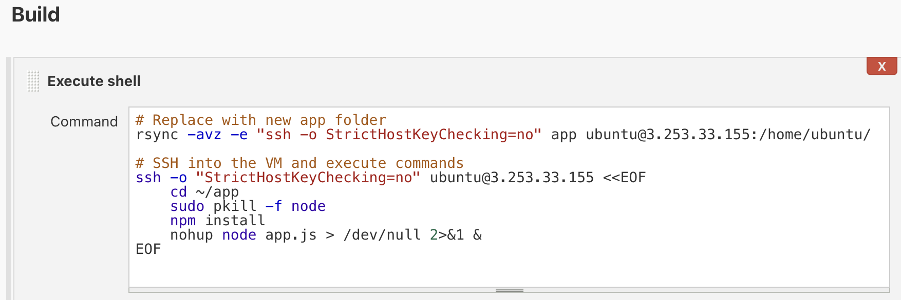

# Jenkins

- Jenkins is an automation tool.
- Everything used in Jenkins is called a job or task.

### Build two jobs and manually trigger them

- Click `Create job` > Enter an item name > click `Freestyle project` > Click `OK`.
  
  

- For General tab, give a description for this job > tick the box for `Discard old builds` > Max # of build to keep: `3`.
  
  

- For Build tab, click dropdown for `Add build step` and select `Execute shell`.
  
  

- In the Command box, enter the following and then click `Save`.
  ```
  whoami
  hostname
  uname -a
  ```

- To execute the job, click `Build Now`.
- You can also view the `Console Output` to see the output of your command(s).
    - `whoami`: Gives the software/tool name.
    - `hostname`: IP address.
    - `uname -a`: actual name of the OS.

### Build a Pipeline

You can build a job, and then based on the success it should trigger the next job. To do that we need at least 2 jobs.

- Go back to the first job > click drop down menu > `Configure` > click `Post-build Actions` > from dropdown choose `Build other projects` > Type the names of the projects in the `Projects to build` field > 
  
  

- Run the job:
  - Click `Build now`.
  - Inspect the `Build Queue`.


##  

- Deploy SSH keys for your GitHub

- We need Jenkins to clone the code
- We need a public key for github and a private key for Jenkins


Provide Node & npm bin/ folder to PATH

