# Automating Application Deployment on AWS with Jenkins CI/CD

Prerequisities:
1. AWS account + .pem file
2. Git Hub repo with app code (containing app folder in the main dir)
3. Set up SSH with localhost and github repo
4. Set up SSH between Github and Jenkins
   <!-- Generate key from local host
   - From Github you need to put pub key into github folder and provide the private key to Jenkins.
   - Jenkins now has the correct access to clone the code. -->
5. Testing branch called `dev`

## Architectural Design


## Jenkins Server 

### Create an Amazon EC2 Instance for Jenkins
Set up Jenkins on an EC2 instance in AWS, in the `Ireland` region, using a t2.micro instance type.

- AWS Management Console > EC2 > Launch instance > Name e.g. `my-tech257-jenkins`.
- Choose the Ubuntu Server 18.04 LTS.
- Instance type: t2.micro > choose an existing Key pair.
- Configure security groups to allow inbound traffic on ports 22 (SSH) and 8080 (Jenkins).
     <br>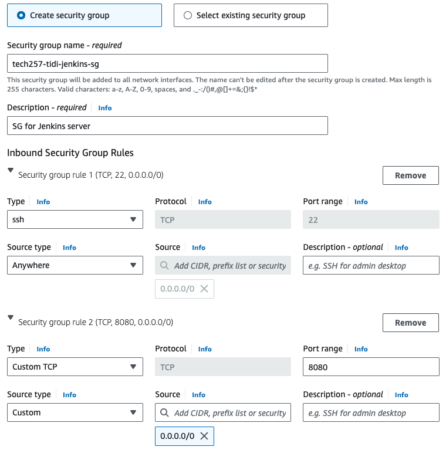 
- `Launch instance`.
  <br>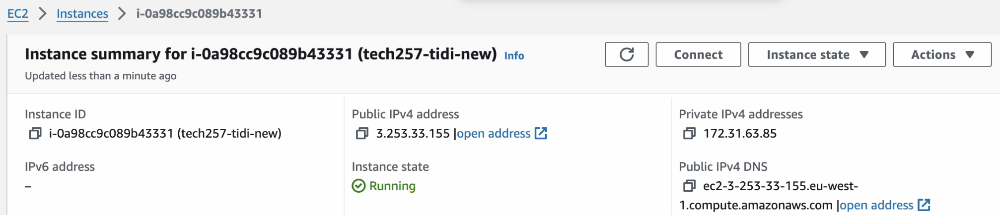

### SSH into Jenkins Server

- Navigate into ssh folder in local machine.
- Connect to the instance using its Public DNS.
- Update the system:
  ```
  sudo apt update
  sudo apt upgrade -y
  ```
- Install Java: `sudo apt install openjdk-17-jre-headless`

  >Note: Jenkins requires Java to run.

- Add the Jenkins repository, import the GPG key and update again:
    ```bash
    sudo wget -O /usr/share/keyrings/jenkins-keyring.asc https://pkg.jenkins.io/debian-stable/jenkins.io-2023.key
    echo deb [signed-by=/usr/share/keyrings/jenkins-keyring.asc] https://pkg.jenkins.io/debian-stable binary/ | sudo tee /etc/apt/sources.list.d/jenkins.list > /dev/null
    sudo apt update
    ```
- Install Jenkins: `sudo apt install jenkins`

- Start the Jenkins service:
bash: `sudo systemctl start jenkins`
- Enable Jenkins to start automatically on system boot: `sudo systemctl enable jenkins`

### Access Jenkins
- Open your web browser and navigate to `http://<your_instance_public_IP>:8080` to access Jenkins.
- Follow the post-installation setup to unlock Jenkins:
  - You'll be prompted to enter the initial admin password. You can retrieve this by running the following in the Jenkins instance you SSH'd in to: `sudo cat /var/lib/jenkins/secrets/initialAdminPassword`
    <br>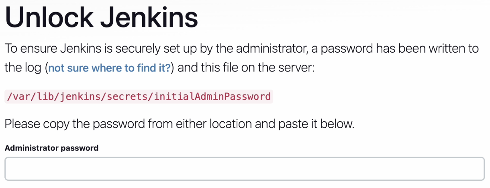

- Click `Continue` and then `Install suggested plugins`.
  - If it doesn't work, run the following in the Jenkins instance: `sudo systemctl restart jenkins`. <!-- OR `sudo systemctl status jenkins` and then `sudo systemctl start jenkins`. -->
  <br>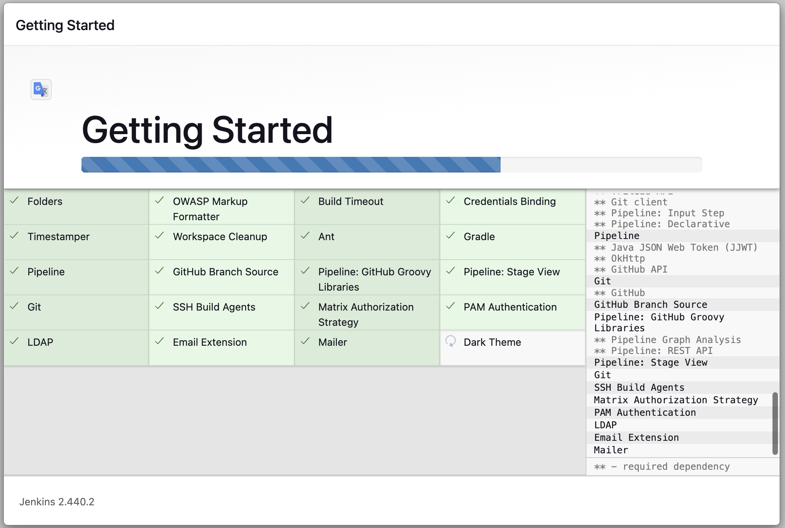

- Create the admin user and provide a Jenkins URL.
  <br>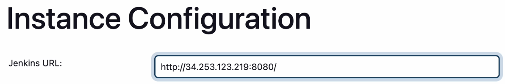
- `Save and Finish`.
- `Start using Jenkins`.

## Jobs on Jenkins Server

- Dashboard > User > New Item > Enter an item name > Freestyle project > OK.

### Continuous Integration (CI)

#### Create Job 1

- Create a new Job called `My-CI`, for example.
- For `General`, give Description: e.g. _Building CI_ > tick `Discard old builds` > Max # of builds to keep: `3` > tick `GitHub project` > provide **Project url** (HTTPS one).
- For `Source Code Managment`, select `Git` > provide **Repository URL** (SSH one) > `+Add` Credentials:
    >  - Kind: `SSH Username with private key`
    >  - Username: [your-key-name]
    >  - On local machine, cat the value of private key for the SSH key connected to this repo.
    >   - Add private key.
  - Note: Get Git plugin to verify the key by going to `Manage Jenkins` > `Security` > `Git Host Key Verifiation Configuration` > select `Accept first connection` > `Save`.
  - Branch Specifier: `*/dev`.
- For `Build Steps` choose `Execute shell`, then enter:
  ```bash
  cp app
  npm install
  npm test
  ```
- Click `Save`.
- Click `Build Now`.

#### Troubleshooting
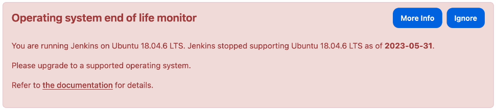

- To fix the error, manually install Node.js that is compatible with Ubuntu 18.04.
- . In the Jenkins instance terminal, run the following:
    ```bash
    curl -fsSL https://deb.nodesource.com/setup_17.x | sudo -E bash - && sudo apt-get install -y nodejs
    ```

- On Jenkins server, click `Build now` for Job 1 again.
- Test the CI setup by making a change to the repository, committing, and pushing it to GitHub.

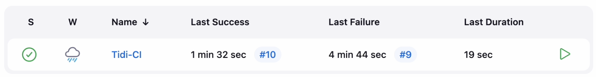

### Continuous Integration with Merge (CI-Merge)

#### Create webhook on GitHub

- Payload URL: [your-payload-url]
- Content type: choose `application/json`
- Click `Add webhook`.

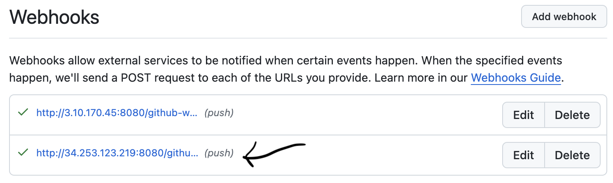

#### Create Job 2

- Create a new Job called `My-CI-Merge`, for example.
- For `General`, give Description: e.g. _merge from dev to main after successful tests_ > tick `Discard old builds` > Max # of builds to keep: `3` > tick `GitHub project` > provide **Project url** (HTTPS one).
- For `Source Code Managment`, select `Git` > provide **Repository URL** (SSH one) > Branch Specifier: `*/main`.
- For `Build Triggers`, tick `Build after other projects are built` and provide the Projects to watch e.g. `My-CI`.
- For `Post-build Actions` choose `Git Publisher`, then the following:
  <br>
- Click `Save`.
- Click `Build Now`.

<br>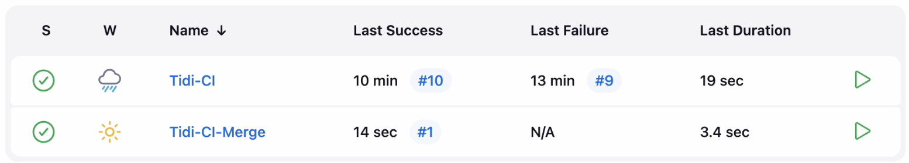

### Continuous Delivery (CD)

#### Manage Jenkins

- Add SSH Agent Plugin on Jenkins server:
    - Jenkins Dashboard > `Manage Jenkins` > `Plugins` > click `SSH Agent` > click `Install`.

- Add AWS Private Key on Jenkins server:
    - Jenkins Dashboard > `Manage Jenkins` > `Credentials` > click `(global)` under Domain > `Add Credentials`.
    - Kind: SSH Username with private key
    - Username: [your-aws-key-name]
    - Paste private key
    - Click `Create`.
     <br>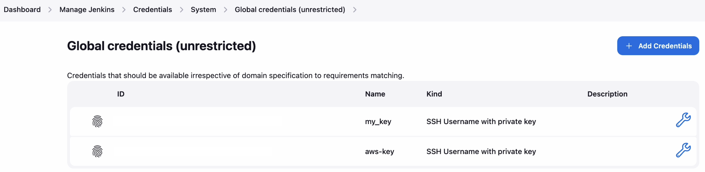

#### Create Application Server

- Image: Ubuntu version 18.04
- Instance type: t2 micro
- Inbound rules for security group: ports 22 (SSH) and 80 (HTTP).


#### Create Job 3

- Create a new Job called `My-CD`, for example.
- For `General`, give Description: e.g. _merge CD with AWS_ > tick `Discard old builds` > Max # of builds to keep: `3` > tick `GitHub project` > provide **Project url** (HTTPS one).
- For `Source Code Managment`, select `Git` > provide **Repository URL** (SSH one) > Branch Specifier: `*/main`.
- For `Build Triggers`, tick `Build after other projects are built` and provide the Projects to watch e.g. `My-CI-Merge`.
- For `Build Environment` tick `SSH agent` and choose AWS private key.
  <br>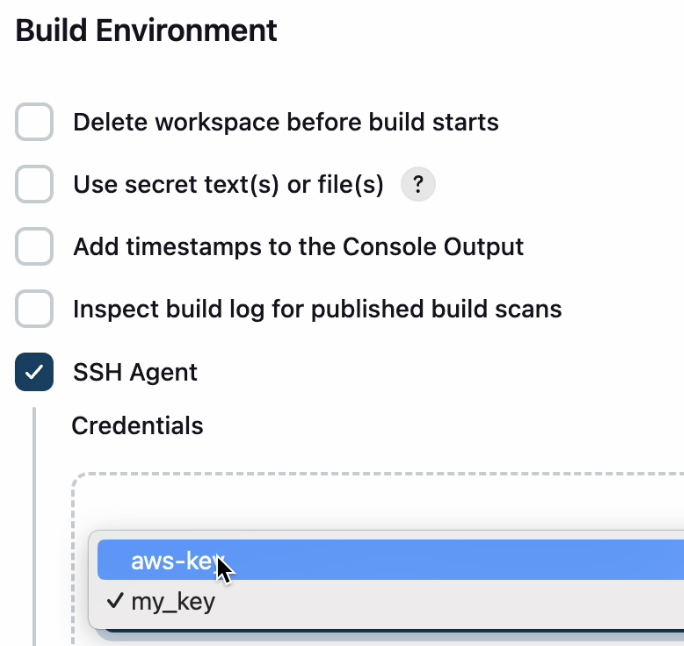
- For `Build Steps` choose `Execute shell`, then enter:
  ```bash
  # Replace with new app folder
  rsync -avz -e "ssh -o StrictHostKeyChecking=no" app ubuntu@[PublicIP-App]:/home/ubuntu/

  # SSH into the VM and execute commands
  ssh -o "StrictHostKeyChecking=no" ubuntu@[PublicIP-App] <<EOF
      cd ~/app
      sudo pkill -f node
      npm install
      nohup node app.js > /dev/null 2>&1 &
  EOF
  ```
- Click `Save`.
- Click `Build Now`.

### Test Pipeline

Click `Build Now` from Job 1.


### Verify deployment on AWS
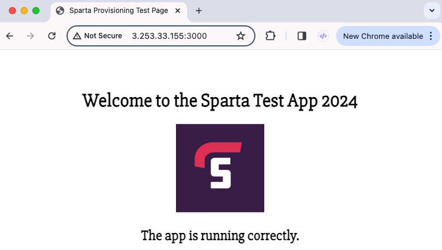

